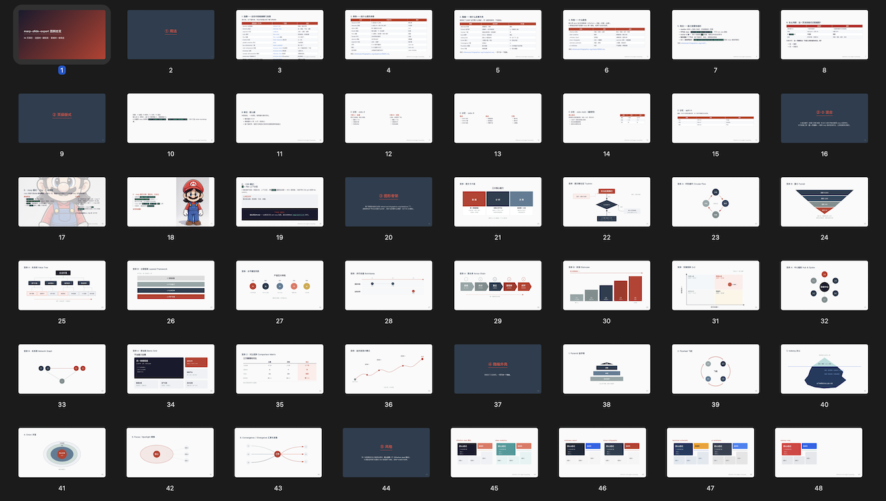

# Marp Slide Expert

> [English](README.md) · 56 页图例：[examples/infographic-gallery.marp.md](examples/infographic-gallery.marp.md)

生成能通过 `marp --pdf --allow-local-files` 干净渲染的 Marp 幻灯片。一个 skill 解决两件事：

1. **页级版式** — 封面 / 分隔 / 单栏 / 多栏分栏 / 图片排布
2. **内联 SVG 信息图** — 16 个骨架、6 个叙事外壳、7 套配色，构成一个四层模块

那些会**静默**破坏 Marp 渲染的坑，你不用再从翻车的 PDF 里学到——skill 已经记下来了。

## 幻灯片示例




## 为什么用这个 skill

- **Marp 默认主题几处必坏的坑** —— 表格半宽、没有 CJK 字体、内容溢出底部。skill 自带一份能用的配色和 CSS，全部修好
- **内联 SVG 跟着文件走** —— PNG 改一个数字要重画；内联 SVG 改一处十六进制值就够。skill 自带 16 套模板和坐标公式，不用边画边算
- **不靠肉眼赌** —— skill 自带 SVG lint（6 项确定性检查），渲染命令写在卡片里。交付前两道自动关卡

## 安装

```bash
# 1. 安装 marp CLI（用于 PDF 导出）
npm install -g @marp-team/marp-cli
# 如果 npm -g 失败，降级为：
npx -y @marp-team/marp-cli --version
```

skill 由 Agent Skills 消费。把它放到 `~/.claude/skills/marp-slide-expert/`，需要做 marp 的 Claude session 会自动加载。

## 快速开始

```markdown
---
marp: true
theme: default
paginate: true
style: |-
  /* 从 references/style-bootstrap.md 整段粘过来 */
---

<!-- _class: cover -->

# 我的 deck 标题

## 副标题

---

## 第一页

- 要点 1
- 要点 2
- 要点 3
```

导出 PDF：

```bash
marp deck.marp.md --pdf --allow-local-files
```

如果用了内联 SVG：

```bash
marp deck.marp.md --html --pdf --allow-local-files
```

## 两条原则

**每页最多 15 行，注释不计入。** 一页显示 15 行可见内容就算满了。HTML 注释不渲染也不占行——演讲者备注就该这么藏。

**页级版式 vs 图级版式。** 不同问题用不同工具：

- 这一页内容很多？ → 分栏 / 分区（`<div class="cols cols-2">`）
- 这一页要表达「节点之间的关系」？ → 内联 SVG

同一份 deck 两类都用，不冲突。

## 里面有什么

| | |
|---|---|
| `references/infographics-svg/` | 16 个骨架模板（阶梯、箭头串、2×2、价值树、桑基、漏斗、泳道、便当格、并列圆圈、图文卡片组、起伏波浪大事记……）+ 6 个叙事外壳（金字塔、飞轮、冰山、漏斗、洋葱、聚焦）+ 7 套配色 |
| `references/layout-patterns.md` | 页级版式菜谱（封面、分隔、内容、分栏、分区、图片叠加） |
| `references/style-bootstrap.md` | UPerform / openclaw 配色 —— 整段粘进 frontmatter 即可 |
| `examples/infographic-gallery.marp.md` | 56 页样例 deck，每个模板都用上 —— 起点就在这 |
| `scripts/svg-lint.mjs` | 6 项确定性 SVG 检查（空行、`---`、id 冲突、坐标越界）。每次渲染前必跑 |
| `scripts/build-gallery.mjs` | 从 references/ 重新生成样例 deck。改了模板重跑就行，不要手改 deck |

## 工作流程

1. 把 `style:` 块从 `references/style-bootstrap.md` 整段粘进 frontmatter
2. 写幻灯片。每页不超过 15 行。内容多用分栏/分区，要表达结构关系就用内联 SVG
3. 如果用了 SVG，跑 `node scripts/svg-lint.mjs deck.marp.md`
4. `marp deck.marp.md --pdf --allow-local-files` 渲染（用了 SVG 加 `--html`）
5. 打开 PDF 逐页看。**不要相信你的 SVG 源码**——渲出来亲眼读
6. 迭代

## 维护

属于 [mebusw/skills](https://github.com/mebusw/skills) 集合。在父仓库提 issue。
